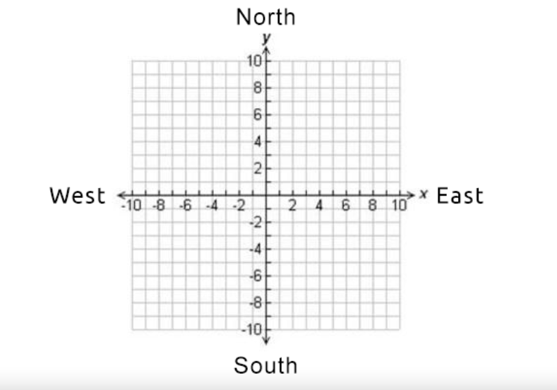

# Mars Rover KATA

You are part of the team that explores Mars by sending remotely 
controlled vehicles to the surface of the planet.
Software translates the commands sent from earth to actions executed by the rover yielding a final state..
When the rover touches down on Mars, it is initialised with its current coordinates and the direction it is facing.
These could be any coordinates, supplied as arguments (x, y, direction) e.g. (4, 2, EAST).

## Part I
The rover is given a command string which contains multiple commands. This string must then be broken into each individual command and that command then executed.
Implement the following commands:
- F -> Move forward on current heading
- B -> Move backwards on current heading
- L -> Rotate left by 90 degrees
- R -> Rotate right by 90 degrees

An example command might be FLFFFRFLB
Once the full command string has been followed, the rover reports it's current coordinates and
heading in the format (6, 4) NORTH

## Constraints and behaviour
These are assumptions about constraints.
- Grid have the boundaries and direction from attached picture. 
- Implement wrapping from one edge of the grid to another. (planets are spheres after all)
- Grid is empty without obstacles.

# How build 

## Prerequisite 

For building and development machine needs to have JDK 17 installed
For running JRE 17 

### Build project

``./gradlew build``

### How to run

#### Run via command line
``java -jar mars-rover-<version>.jar <roverInitState> <roverCommands>``

Example:
``java -jar mars-rover-1.0-SNAPSHOT.jar "4|2|EAST" "FLFFFRFLB"``

#### Run via gradle
``./gradlew runMarsRoverApplication -ProverInitState=<roverInitState> -ProverCommands=<roverCommands>``

Example:
``java -jar mars-rover-1.0-SNAPSHOT.jar -ProverInitState="4|2|EAST" -ProverCommands="FLFFFRFLB"``
